

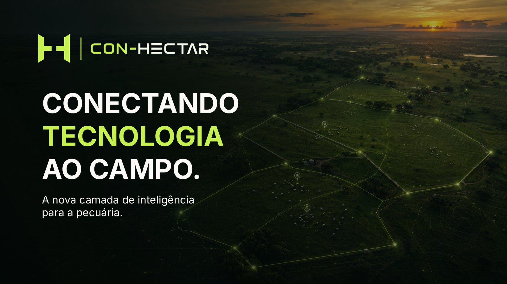

 
 

### A nova camada de inteligência para a pecuária brasileira.

Coleiras GPS de baixo custo + rede LoRa própria + imagens de satélite Sentinel-2, 
fundidas em um **sistema de decisão de pastejo**: quando tirar o lote, para onde mandar, e o que está errado agora.

 

[**Visão geral**](#-o-problema) ·
[**Como funciona**](#-como-funciona) ·
[**O que já foi construído**](#-o-que-já-foi-construído) ·
[**Hardware**](#-hardware) ·
[**Plataforma**](#-plataforma) ·
[**Inteligência**](#-a-inteligência) ·
[**Mercado**](#-mercado) ·
[**Roadmap**](#-desafios-e-próximos-passos)

---

> [!NOTE]
> **Este é um repositório de apresentação.** Ele documenta o que a Con-Hectar construiu — hardware, firmware, gateway, nuvem, painel web, app e motores de decisão — com fotos reais, arquitetura e números medidos em bancada. O código-fonte de produção é proprietário e fica em repositório privado; acesso para avaliação técnica pode ser concedido sob demanda.

 

## ◆ O problema

<table>
<tr>
<td width="55%" valign="top">

A pecuária de corte brasileira é a maior do mundo em rebanho comercial — e uma das menos produtivas por hectare. A fazenda média produz **~5 @/ha/ano**; a fazenda bem manejada produz **12,9 @/ha/ano**. São **2,7×** de diferença na mesma terra, e **≈ R$ 441/ha/ano** de margem bruta deixada na porteira.

A maior parte desse gap não é genética nem insumo. É **manejo de pasto**: decidir *quando* tirar o lote de um piquete e *para onde* mandá-lo. Hoje isso é feito no "olhômetro", com uma ronda que, em fazenda extensiva, acontece a cada 3, 7 ou 15 dias.

Os produtos que já existem escolhem um lado: ou olham para o **animal** (rastreadores, brincos) ou olham para o **pasto** (satélite, NDVI). Nenhum funde os dois.

</td>
<td width="45%" valign="top">

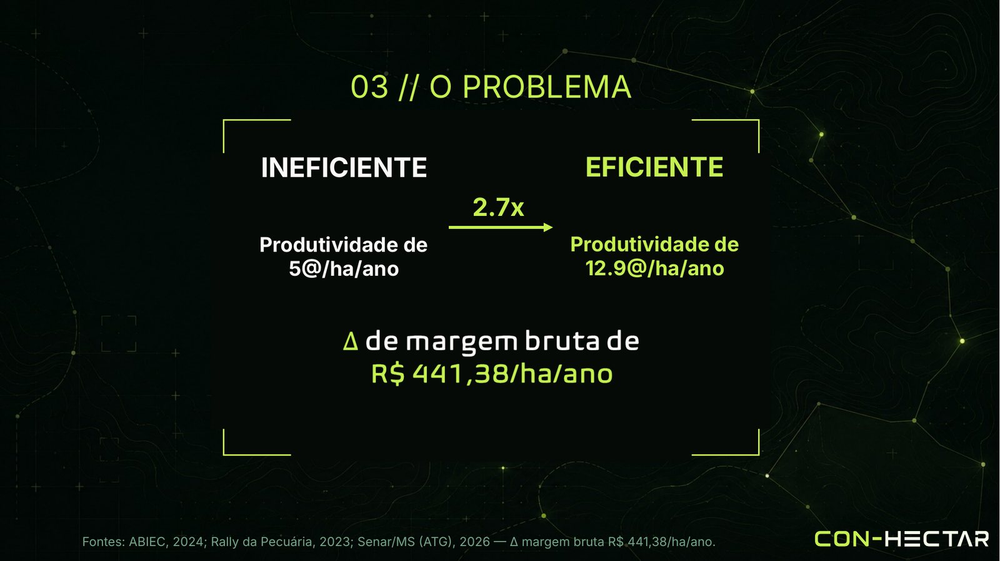

Fontes: ABIEC, 2024; Rally da Pecuária, 2023; Senar/MS (ATG), 2026.

</td>
</tr>
</table>

### A tese

> **O rebanho avisa que o piquete acabou antes de o satélite conseguir enxergar isso.**
>
> Conforme a forragem se esgota, o bovino aumenta o tempo de pastejo e a distância percorrida de forma monotônica e mensurável. O satélite diz o que **tem** no piquete; o animal diz o que ele **acha** que tem. Quando os dois discordam, o animal ganha — porque ele está lá dentro. **Essa fusão é o produto.**

A Con-Hectar não vende rastreador. Vende um **sistema de suporte à decisão de pastejo cujo sensor primário é o próprio rebanho**, respondendo — sem que ninguém pergunte — às três perguntas que custam dinheiro na fazenda:

| | Pergunta | Hoje | Com a Con-Hectar |
|:-:|---|---|---|
| **1** | Quando tiro o lote deste piquete? | Olhômetro do capataz | Voto combinado **satélite × comportamento do rebanho** |
| **2** | Para onde mando? | Sequência fixa do croqui | Fila de rotação ranqueada pela forragem real e descanso aprendido |
| **3** | Tem algo errado com um animal ou com a infraestrutura? | Descoberto na próxima ronda | Alerta classificado, com evidência e ação sugerida |

 

## ◆ Como funciona

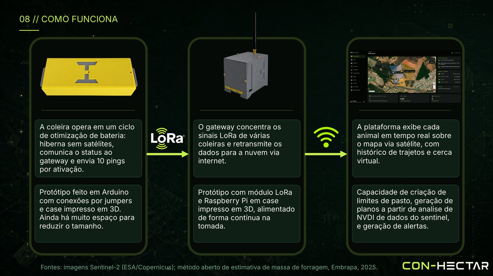

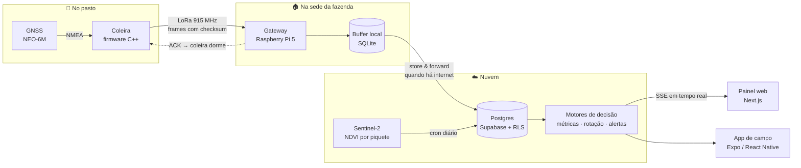
```mermaid
flowchart LR
  subgraph Campo["🐂 No pasto"]
    GPS["GNSS<br/>NEO-6M"] -->|NMEA| MCU["Coleira<br/>firmware C++"]
  end
  MCU -- "LoRa 915 MHz<br/>frames com checksum" --> GW
  GW -. "ACK → coleira dorme" .-> MCU
  subgraph Sede["🏠 Na sede da fazenda"]
    GW["Gateway<br/>Raspberry Pi 5"] --> BUF[("Buffer local<br/>SQLite")]
  end
  BUF -- "store & forward<br/>quando há internet" --> DB
  subgraph Nuvem["☁️ Nuvem"]
    DB[("Postgres<br/>Supabase + RLS")]
    SAT["Sentinel-2<br/>NDVI por piquete"] -- "cron diário" --> DB
    DB --> ENG["Motores de decisão<br/>métricas · rotação · alertas"]
  end
  ENG -- "SSE em tempo real" --> WEB["Painel web<br/>Next.js"]
  ENG --> APP["App de campo<br/>Expo / React Native"]
```

1. **Coleira** — acorda, obtém um fixo GPS, transmite por LoRa até receber confirmação do gateway e volta a dormir. Projetada para economizar bateria acima de tudo.
2. **Gateway** — concentra os sinais LoRa de várias coleiras, confirma o recebimento assim que o dado está **no próprio disco**, e encaminha para a nuvem sempre que houver internet. Continua operando quando a internet da fazenda cai.
3. **Nuvem** — cada fixo é imutável; métricas, rotação e alertas são derivados e recalculáveis. Imagens Sentinel-2 alimentam o NDVI de cada piquete automaticamente.
4. **Plataforma** — mapa em tempo real, cercas virtuais, plano de pastejo rotativo, saúde do rebanho e uma central de alertas que nunca confunde "animal parado" com "coleira sem sinal".

➜ Detalhes em [`docs/arquitetura.md`](docs/arquitetura.md)

 

## ◆ O que já foi construído

Tudo abaixo existe, roda, e foi construído do zero — da solda ao pixel.

<table>
<tr>
<td width="50%" valign="top">

#### 🔧 Hardware & firmware
- [x] Coleira GPS + LoRa em Arduino, com case impresso em 3D
- [x] Firmware com ciclo de energia: GPS → transmite → aguarda ACK → dorme
- [x] Protocolo de rádio próprio com checksum, endereçamento e número de sequência
- [x] Anticolisão entre coleiras (jitter e backoff aleatórios por dispositivo)
- [x] Gerenciamento de energia do MCU e *sleep* do rádio por pinos de modo
- [x] Gateway em Raspberry Pi 5 com módulo LoRa, case 3D e serviço `systemd`
- [x] **Store-and-forward**: buffer local em SQLite que sobrevive a quedas de internet
- [x] Modelos 3D próprios da coleira e do gateway ([abrir no visualizador 3D](models/coleira.stl))

</td>
<td width="50%" valign="top">

#### ☁️ Nuvem & plataforma
- [x] Schema Postgres completo com Row Level Security
- [x] Stream de posições ao vivo via **Server-Sent Events**, autenticado
- [x] Painel web com **11 módulos** (mapa, rebanho, coleiras, cercas, pastagens, movimentação, saúde, alertas, relatórios…)
- [x] Desenho de cercas e piquetes direto no mapa de satélite
- [x] **Sincronização automática de NDVI** (Sentinel-2) por piquete
- [x] **Divisão automática de pastagens** em piquetes de área pastejável equivalente
- [x] **Motor de rotação**, **motor de anomalias** e **classificador de silêncio**
- [x] App de campo multiplataforma (iOS / Android / Web) em Expo
- [x] Landing page com visualizador 3D do hardware

</td>
</tr>
</table>

 

## ◆ Hardware

<table>
<tr>
<td width="33%" valign="top">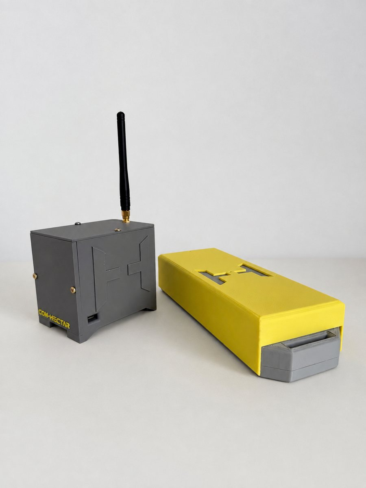 <b>Coleira e gateway.</b> Os dois dispositivos nos cases finais, impressos em 3D.</td>
<td width="33%" valign="top">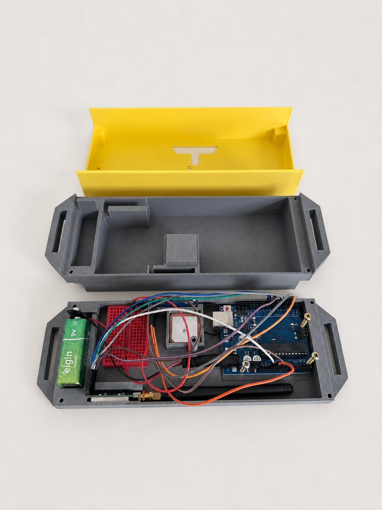 <b>Por dentro da coleira.</b> MCU, GNSS, rádio LoRa e bateria acomodados em case projetado sob medida.</td>
<td width="33%" valign="top">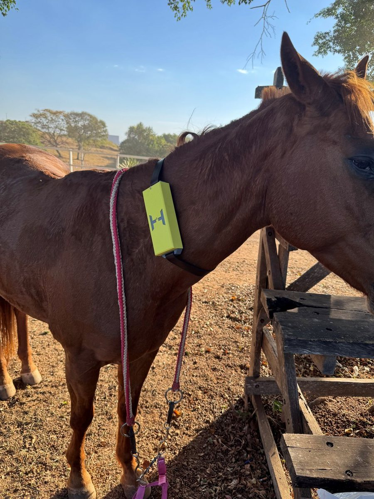 <b>Teste de fixação em animal.</b> Coleira no case final, posicionada no pescoço.</td>
</tr>
</table>

#### Da folha de caderno ao campo

| ① Esquemático | ② Coleira na bancada | ③ Gateway na bancada | ④ Case final |
|:-:|:-:|:-:|:-:|
| 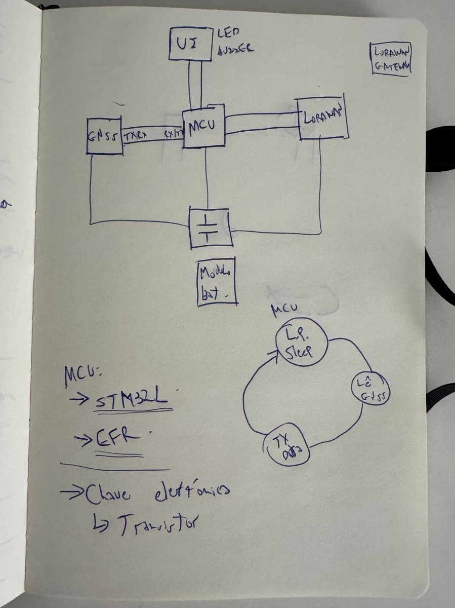 | 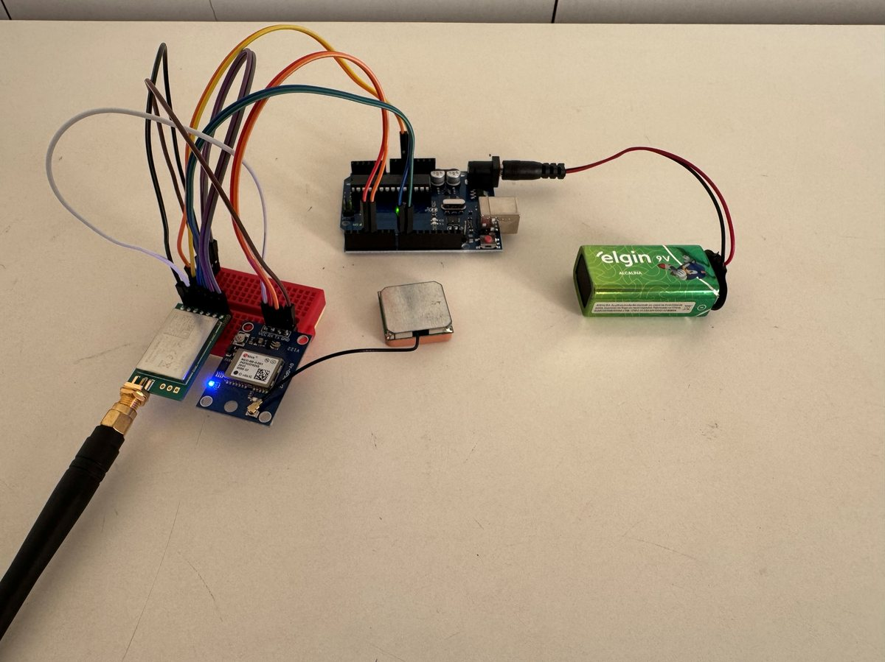 | 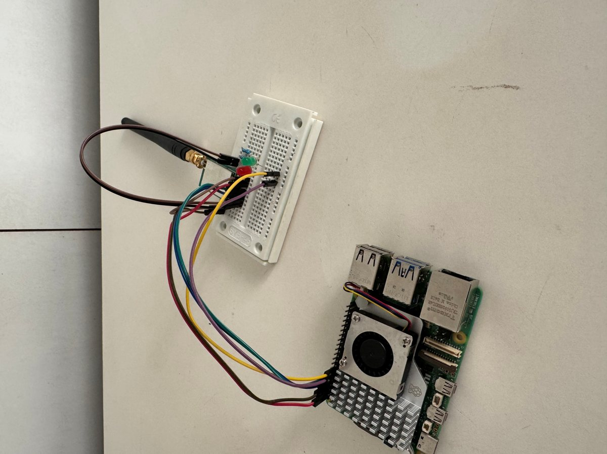 | 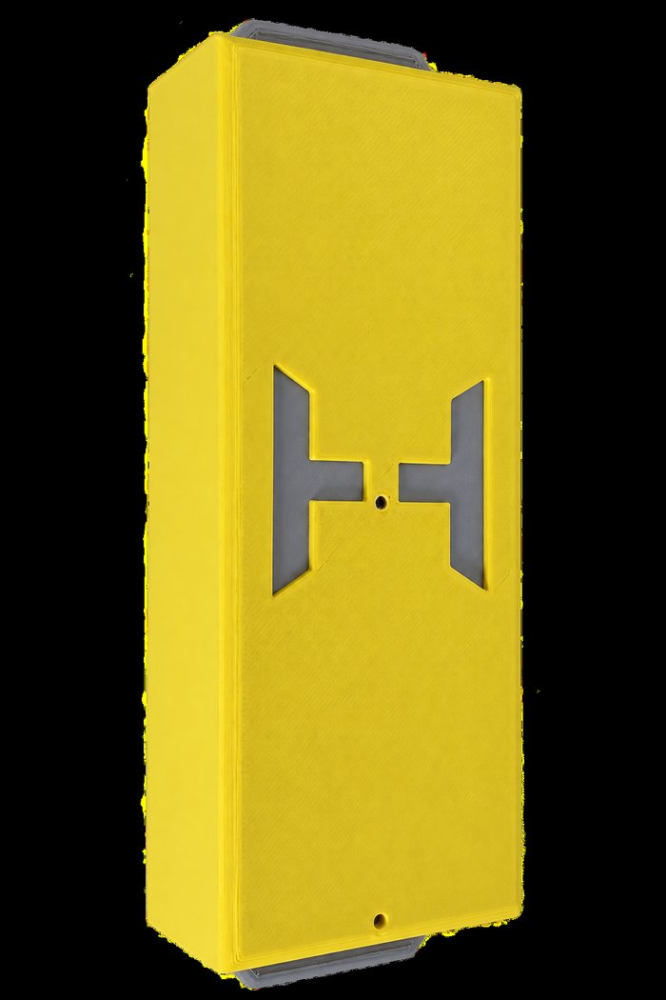 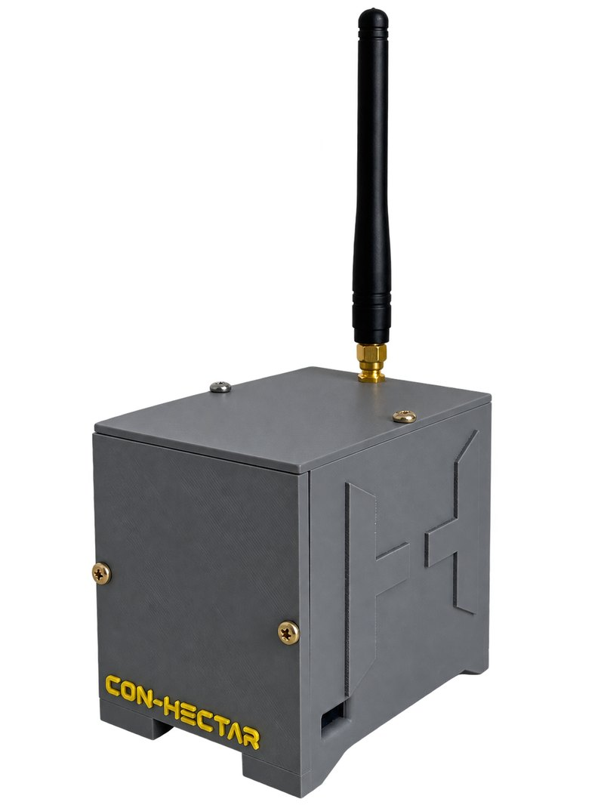 |
| Arquitetura e ciclo de sono rascunhados à mão | Arduino + GNSS + LoRa em jumpers | Raspberry Pi 5 + LoRa via UART | Coleira e gateway em cases impressos em 3D |

#### Modelos 3D

Os cases foram modelados do zero e são os mesmos arquivos exibidos no visualizador 3D da landing page. O GitHub os abre em um visualizador interativo — **clique para girar e dar zoom**:

| [🟡 Coleira — `models/coleira.stl`](models/coleira.stl) | [⬛ Gateway — `models/gateway.stl`](models/gateway.stl) |
|:-:|:-:|
| <a href="models/coleira.stl">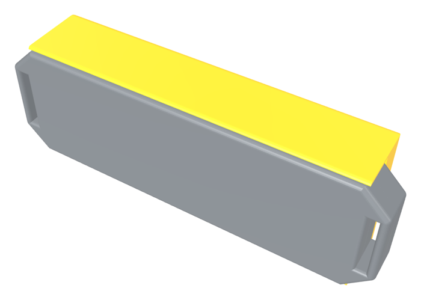</a> | <a href="models/gateway.stl">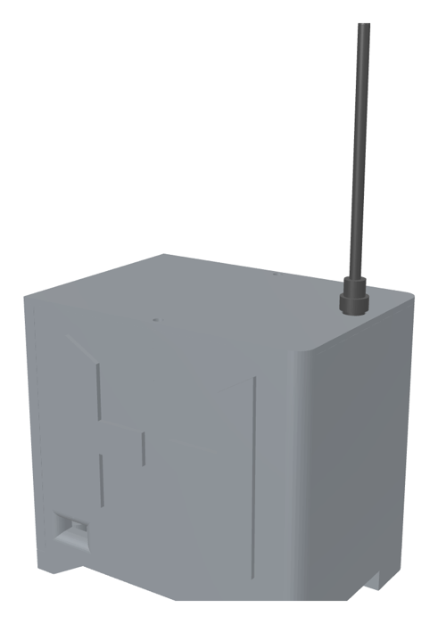</a> |
| 235 × 46 × 80 mm · tampa, base e cobertura | 99 × 72 × 174 mm com antena |

| Componente | Coleira | Gateway |
|---|---|---|
| **Processamento** | Microcontrolador AVR (protótipo) → MCU de baixo consumo (próxima rev.) | Raspberry Pi 5 · Debian 13 |
| **Posicionamento** | GNSS u-blox | — |
| **Rádio** | LoRa sub-GHz, faixa ISM ANATEL | LoRa sub-GHz, mesma faixa |
| **Software** | Firmware C++ com máquina de estados de energia | Serviço Python: ACK · armazenar · encaminhar · podar |
| **Persistência** | — | SQLite local (sobrevive a quedas de internet) |
| **Alimentação** | Bateria | Contínua (tomada) |
| **Case** | Impresso em 3D, projeto próprio | Impresso em 3D, projeto próprio |

➜ Detalhes em [`docs/hardware.md`](docs/hardware.md)

 

## ◆ Plataforma

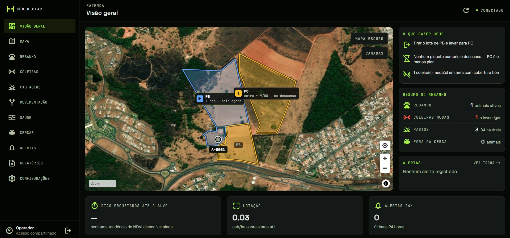

Painel em funcionamento: mapa de satélite com piquetes, lotes e coleiras ao vivo; à direita, "o que fazer hoje" e o resumo do rebanho.

| Módulo | O que resolve |
|---|---|
| **Visão geral** | O que fazer hoje — recomendações priorizadas, não um mural de gráficos |
| **Mapa** | Cada animal em tempo real sobre imagem de satélite, com trajetos, gateways e pontos de recurso (cocho, água) |
| **Rebanho** | Cadastro de animais e lotes, vínculo animal ↔ coleira com histórico temporal |
| **Coleiras** | Estado de cada dispositivo, qualidade de rádio e diagnóstico de silêncio |
| **Cercas** | Cercas virtuais com regras de entrada/saída por período, detecção de fuga com histerese |
| **Pastagens** | Piquetes, NDVI, estado (ocupado · pronto · descansando), fila de rotação e divisão automática |
| **Movimentação** | Distância, área de uso e orçamento de atividade por animal e por lote |
| **Saúde** | Eventos sanitários e anomalias comportamentais com evidência |
| **Alertas** | Central de alertas com severidade, explicação e ação sugerida |
| **Relatórios** | Indicadores históricos para decisão e prestação de contas |
| **Configurações** | Fazenda, intervalos de amostragem, limiares |

#### App de campo e conceito de interface

O mesmo sistema de design no celular do peão, no tablet em campo e no desktop do gerente. O app é construído em Expo/React Native.

| Mapa principal | Ficha do animal | Cercas virtuais | Central de alertas |
|:-:|:-:|:-:|:-:|
| 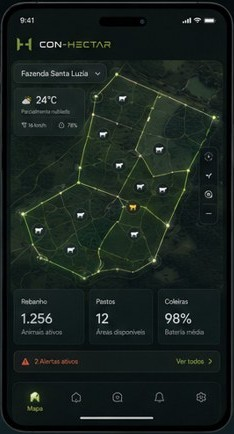 | 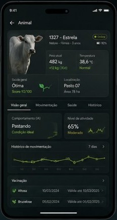 | 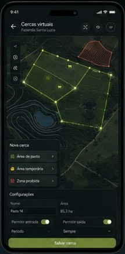 | 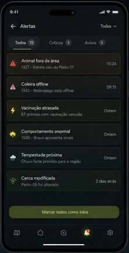 |

<table>
<tr>
<td width="68%">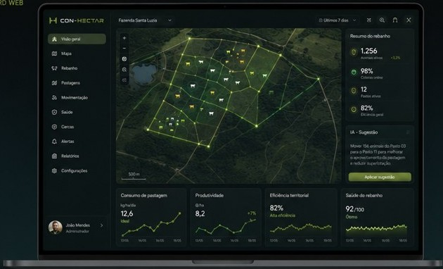</td>
<td width="32%">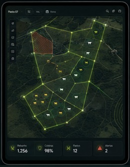</td>
</tr>
<tr>
<td><b>Dashboard web</b> — resumo do rebanho, sugestão de manejo e indicadores de pastagem.</td>
<td><b>Tablet em campo</b> — mapa e cercas em tela cheia.</td>
</tr>
</table>

Telas de conceito do design inicial. A versão em funcionamento é o painel acima; alguns campos do conceito (como temperatura e bateria) foram retirados porque o hardware atual não os mede.

➜ Detalhes em [`docs/plataforma.md`](docs/plataforma.md)

 

## ◆ A inteligência

A plataforma é organizada em **cinco camadas**, cada uma alimentando a seguinte. Todas são derivadas **apenas de posição, tempo e satélite** — sem prometer o que o hardware não mede.

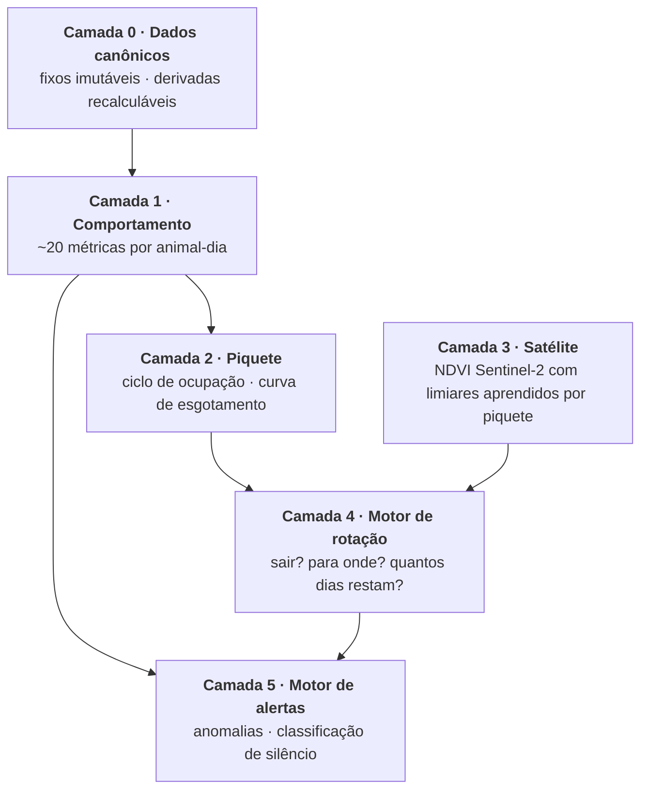
```mermaid
flowchart TB
  L0["<b>Camada 0 · Dados canônicos</b><br/>fixos imutáveis · derivadas recalculáveis"]
  L1["<b>Camada 1 · Comportamento</b><br/>~20 métricas por animal-dia"]
  L2["<b>Camada 2 · Piquete</b><br/>ciclo de ocupação · curva de esgotamento"]
  L3["<b>Camada 3 · Satélite</b><br/>NDVI Sentinel-2 com limiares aprendidos por piquete"]
  L4["<b>Camada 4 · Motor de rotação</b><br/>sair? para onde? quantos dias restam?"]
  L5["<b>Camada 5 · Motor de alertas</b><br/>anomalias · classificação de silêncio"]
  L0 --> L1 --> L2 --> L4
  L3 --> L4
  L1 --> L5
  L4 --> L5
```

| Motor | O que faz | Por que é diferente |
|---|---|---|
| **Métricas comportamentais** | Distância filtrada, sinuosidade, área de uso, raio de giro, tempo em pastejo × deslocamento × repouso | Filtra a "caminhada fantasma" do erro de GPS e se recusa a comparar dias com intervalos de amostragem diferentes |
| **Rotação** | Decide quando sair do piquete por **voto de duas fontes** — satélite e comportamento — e ranqueia o próximo | Quando as fontes discordam, a interface **mostra a discordância** em vez de esconder |
| **Satélite (NDVI)** | Sincroniza Sentinel-2 por piquete e aprende os limiares de entrada/saída **do próprio histórico do piquete** | Zero calibração manual: nenhum operador escolhe espécie ou digita altura de capim |
| **Anomalias** | Falha de aguada, animal caído, doença, isolamento, coesão do rebanho, cio | Linha de base robusta (mediana/MAD), normalizada contra o próprio lote no mesmo dia, com persistência — e dez animais com a mesma anomalia viram **um** alerta de infraestrutura |
| **Silêncio** | Classifica por que uma coleira parou de falar: sombra de rádio, falha de dispositivo ou silêncio sem explicação | Um falso "animal morto" queima mais confiança do que dez acertos constroem |
| **Divisão de pastagens** | Corta uma pastagem em N piquetes de área pastejável equivalente, como um cerqueiro faria | Balanceada por NDVI; sugere N a partir de dias de descanso e ocupação |

➜ Detalhes em [`docs/inteligencia.md`](docs/inteligencia.md)

 

## ◆ Medido, não estimado

Uma regra da casa: **o que foi medido é marcado como medido; o que foi calculado é marcado como calculado.**

| Verificação | Resultado | |
|---|:-:|---|
| Link GPS (sentenças NMEA com checksum válido) | **120 / 0** | ✅ medido |
| Frames de rádio coleira → gateway | **6 / 0 perdidos** | ✅ medido |
| Latência de ingestão (fixo armazenado → nuvem) | **7 s** | ✅ medido |
| Stream ao vivo sem / com sessão | **401 / 200** | ✅ medido |
| Ganho do sono do MCU no consumo médio | ≈ 2 % | ⚠️ calculado — revelou que o gargalo é o GNSS e a placa, não o MCU |

➜ Diário completo, incluindo as falhas encontradas, em [`docs/engenharia.md`](docs/engenharia.md)

 

## ◆ Mercado

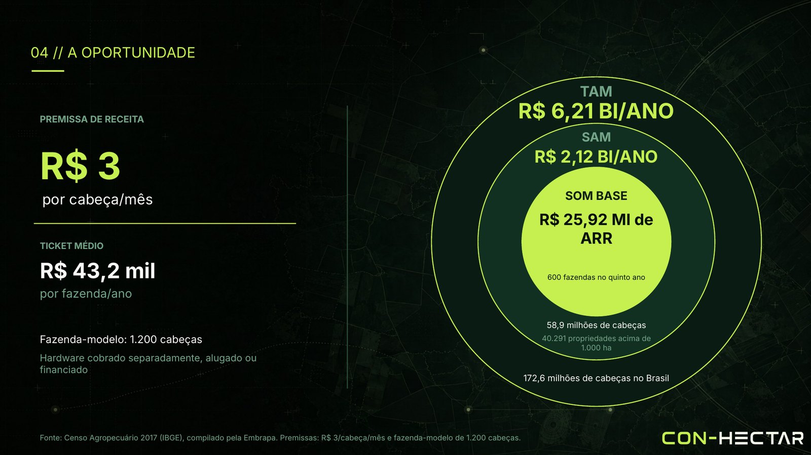

| | | |
|---|---|---|
| 🐂 **238 mi** cabeças de gado (IBGE, 2024) | 🌱 **167 mi** ha de pastagem | 💰 **R$ 1,1 tri** movimentados por ano |
| **TAM** R$ 6,21 bi/ano | **SAM** R$ 2,12 bi/ano — 40.291 propriedades > 1.000 ha | **SOM** R$ 25,9 mi ARR — 600 fazendas no ano 5 |

**Modelo:** assinatura de **R$ 3 por cabeça/mês** (ticket médio de R$ 43,2 mil/fazenda/ano numa fazenda-modelo de 1.200 cabeças). Hardware cobrado à parte — venda, aluguel ou financiamento. Cobrar por cabeça, e não por coleira, só se justifica porque o produto entrega **decisão**, não posição.

➜ Detalhes em [`docs/negocio.md`](docs/negocio.md)

 

## ◆ Desafios e próximos passos

<table>
<tr>
<td width="50%" valign="top">

#### Desafios honestos
- Conexão do Raspberry Pi à rede local falhou no último teste de campo
- Jumpers e módulos de prateleira elevaram custo e tamanho da coleira
- Imagens de satélite escassas em períodos de seca geraram erros nos piquetes
- O sono do MCU rende pouco: o consumo está no GNSS e na placa de desenvolvimento

</td>
<td width="50%" valign="top">

#### Próximos passos
- [ ] Resolver a conectividade do gateway em campo
- [ ] Melhorar a geração automática de piquetes
- [ ] Coleira em **PCB própria** com MCU de baixo consumo
- [ ] Modo *power-save* do GNSS e buffer de fixos na coleira
- [ ] Piloto com **+1 coleira ativa** e depois um lote inteiro

</td>
</tr>
</table>

➜ Roadmap completo em [`docs/negocio.md#roadmap`](docs/negocio.md#roadmap)

 

## ◆ Linha do tempo

| Fase | Marco | Entregas |
|:-:|---|---|
| **01** | Entender o problema | Pesquisa e conversas com pecuaristas · esquemático da eletrônica · consolidação da tese |
| **02** | Provar a cadeia | Eletrônica em bancada · fazenda-piloto definida · documento de requisitos de produto · planejamento do software |
| **03** · *atual* | Construir o produto | **15/08** coleira C0001 → gateway → nuvem → mapa ao vivo, ponta a ponta · **19/08** motor de rotação, sync NDVI Sentinel-2, divisão automática de piquetes e motor de alertas · cases 3D, modelos 3D e teste de fixação em animal |

 

## ◆ Documentação

| Documento | Conteúdo |
|---|---|
| [`docs/arquitetura.md`](docs/arquitetura.md) | Cadeia ponta a ponta, protocolo de rádio, modelo de dados, decisões de projeto, segurança |
| [`docs/hardware.md`](docs/hardware.md) | Coleira, gateway, ciclo de energia, análise de consumo, evolução do protótipo |
| [`docs/plataforma.md`](docs/plataforma.md) | Painel web, app de campo, sistema de design e princípios de produto |
| [`docs/inteligencia.md`](docs/inteligencia.md) | As cinco camadas: métricas, satélite, rotação, anomalias e silêncio |
| [`docs/engenharia.md`](docs/engenharia.md) | O que foi medido, falhas encontradas e como foram resolvidas, itens em aberto |
| [`docs/negocio.md`](docs/negocio.md) | Problema, mercado, concorrência, modelo de receita e roadmap |

 

---

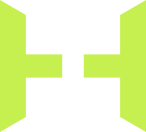

**Con-Hectar** · Goiânia, GO

Fundador: **Gabriel Bassi** — [gabrielbassidebm@gmail.com](mailto:gabrielbassidebm@gmail.com)

© 2026 Con-Hectar. Todos os direitos reservados. Fotos, renders, marcas e documentação deste repositório não podem ser reproduzidos sem autorização.

