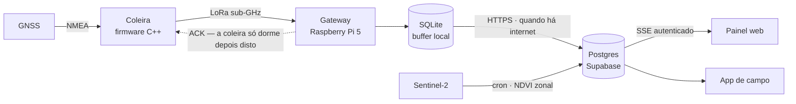
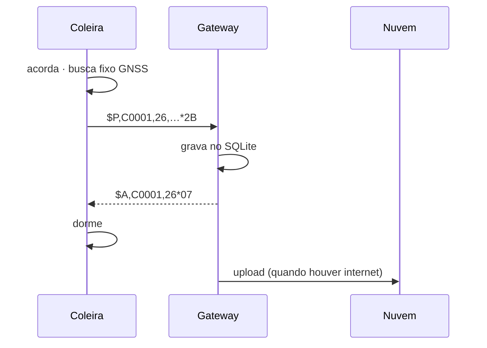
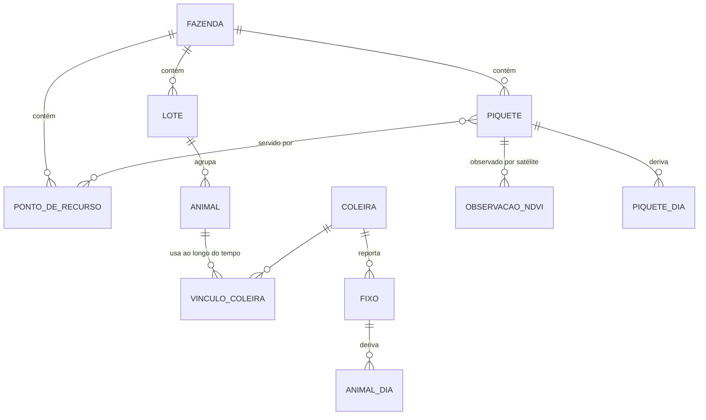

<picture><source media="(prefers-color-scheme: dark)" srcset="../assets/brand/logo-wordmark-tight-duotone.svg"></picture>

# Arquitetura

[← Voltar ao README](../README.md)

A Con-Hectar é um sistema ponta a ponta: do receptor GNSS no pescoço do animal até a recomendação de manejo na tela do gerente. Cada elo foi construído e colocado de pé separadamente — porque uma falha em qualquer um deles parece idêntica do outro lado: **nenhum ponto no mapa**.

---

## 1. A cadeia



| Elo | Tecnologia | Responsabilidade |
|---|---|---|
| Coleira | Microcontrolador + GNSS + LoRa · C++ | Obter um fixo, entregá-lo com confirmação, dormir |
| Rádio | LoRa sub-GHz, faixa ISM homologável pela ANATEL | Longo alcance, baixíssimo consumo, sem depender de operadora |
| Gateway | Raspberry Pi 5 · Python · `systemd` | Confirmar, persistir localmente, encaminhar, podar |
| Banco | Supabase (Postgres + Realtime + RLS) | Fonte da verdade; fixos imutáveis |
| Satélite | Copernicus Sentinel-2 via API estatística | NDVI por piquete, sem intervenção humana |
| Web | Next.js 16 · React 19 · MapLibre GL · Three.js | Painel de gestão e landing page |
| Mobile | Expo · React Native | App de campo para iOS, Android e Web |
| Deploy | Vercel (web + cron) | Deploy contínuo a partir do branch principal |

---

## 2. Protocolo de rádio

Um protocolo textual, compacto e verificável — inspirado em NMEA — desenhado para ser depurável com um monitor serial e robusto o bastante para várias coleiras dividindo o mesmo canal.

```
$P,<coleira>,<seq>,<timestamp>,<lat>,<lng>,<vel>,<rumo>,<sats>,<hdop>*XX   fixo
$S,<coleira>,<seq>,<sats>,<diag>*XX                                       sem fixo neste ciclo
$A,<coleira>,<seq>*XX                                                      gateway → coleira
```

`XX` é um checksum XOR. Três decisões fazem a diferença:

- **O timestamp vem dos satélites, não do gateway.** Um fixo que ficou horas no buffer ainda registra quando foi realmente tomado.
- **`$S` existe de propósito.** Uma coleira que não enxerga o céu ainda completa o ciclo e dorme — e o enlace de rádio continua testável dentro de casa.
- **Compartilhar o ar.** Cada coleira constrói exatamente o ACK que espera (endereço + sequência), então o ACK de outra coleira — ou um ACK atrasado do ciclo anterior — nunca é aceito. Atrasos antes da transmissão e entre tentativas são aleatórios e semeados por dispositivo, para que duas coleiras que acordam juntas se afastem em vez de colidir a cada nova tentativa.



---

## 3. A decisão mais importante: o ACK não espera a nuvem

Uma coleira mantém o rádio ligado até ouvir a confirmação. Se o ACK dependesse do upload, **toda coleira ficaria acordada durante uma queda de internet** — exatamente quando a bateria mais importa. Por isso o gateway confirma no instante em que o fixo está no **próprio disco**. A partir daí a coleira não deve mais nada e pode dormir; o acúmulo é drenado depois.

O gateway também poda o buffer local com um teto de retenção, para que meses de operação offline não esgotem o cartão SD.

---

## 4. Modelo de dados

O modelo foi desenhado em torno de uma regra: **os dados brutos são imutáveis; tudo o que é calculado pode ser destruído e reconstruído do zero.** Os algoritmos vão mudar dezenas de vezes no primeiro ano — o histórico por animal, não.



- **Vínculo animal ↔ coleira é temporal**, com início e fim — a troca de coleira entre animais é a operação mais comum e a mais mal modelada em produtos do setor.
- **Área útil ≠ área do polígono.** Açude, mata e estrada são descontados; o erro aqui se propagaria para todo o balanço forrageiro.
- **Pontos de recurso** (água, cocho, sombra, porteira) têm relação N:N com piquetes — um bebedouro pode servir dois.
- Cada métrica derivada carrega a **versão do algoritmo** que a calculou, para que "o número mudou sozinho" tenha resposta.

---

## 5. Tempo real

Posições chegam ao painel por um stream **Server-Sent Events** autenticado pela sessão do usuário. O cliente reconecta sozinho, enquadra o mapa automaticamente nas coleiras ativas e diferencia visualmente fixos de baixa qualidade (que aparecem no mapa, mas não entram em nenhum cálculo).

---

## 6. Segurança

| Camada | Medida |
|---|---|
| Banco | Row Level Security em todas as tabelas; funções internas fora do schema público exposto pela API REST |
| Stream ao vivo | Exige sessão válida — `401` sem cookie, `200` com cookie (verificado) |
| Jobs agendados | Rotas de cron protegidas por segredo compartilhado |
| Segredos | Somente em variáveis de ambiente; nada versionado |

---

## 7. Princípios de engenharia

1. **Cada salto é testado isoladamente.** Coleira, rádio, gateway, banco e mapa têm cada um sua própria verificação.
2. **Medido ≠ calculado.** Toda documentação marca qual é qual.
3. **Nenhum número inventado.** A coleira não mede bateria — então o painel não mostra bateria. Preferimos remover uma tela a exibir um dado que teríamos de adivinhar.
4. **Silêncio nunca é ambíguo.** "Animal parado" e "coleira sem cobertura" são estados diferentes, com mensagens e ações diferentes.
5. **Offline-first.** Só ~34 % da área agrícola brasileira tem cobertura 4G/5G. O sistema assume que a internet vai cair.
