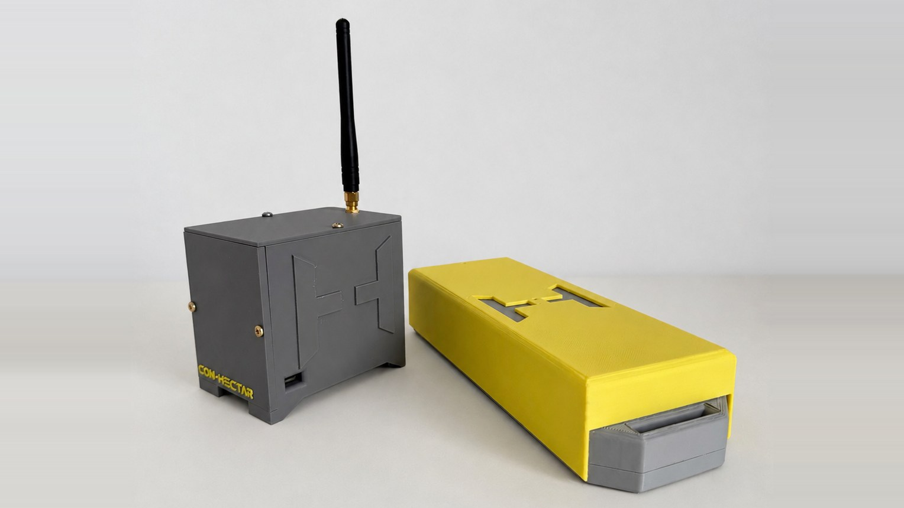
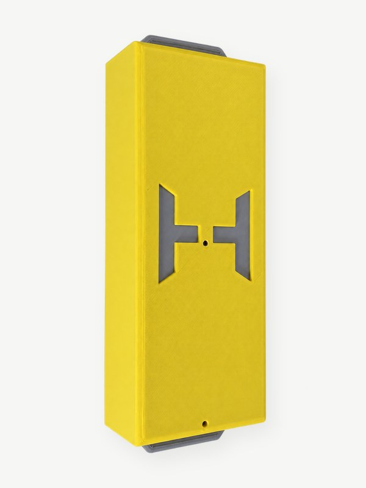
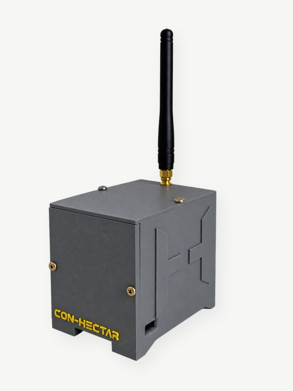
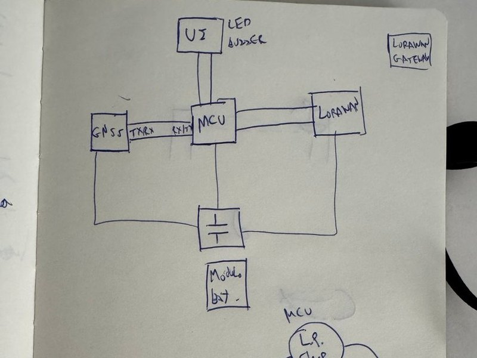
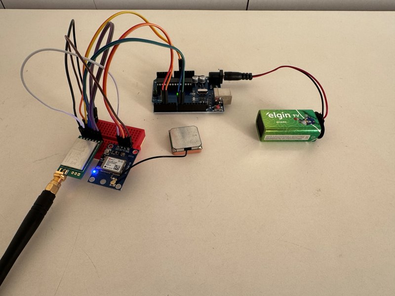
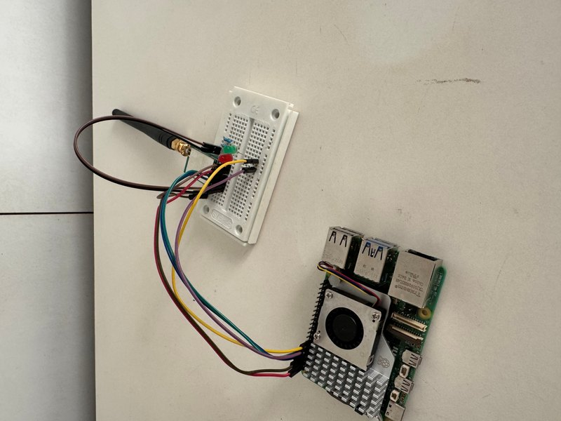
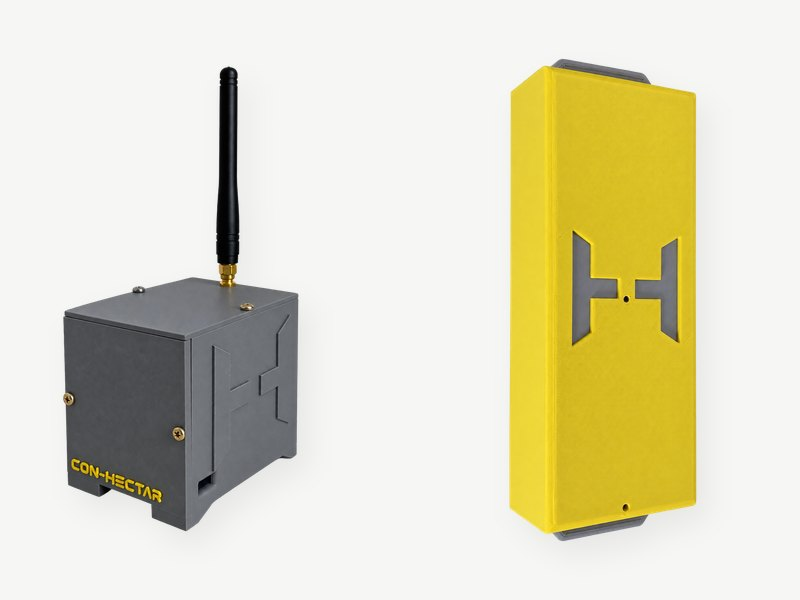
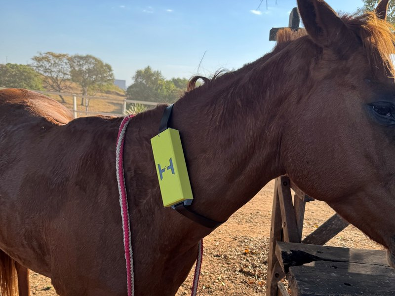
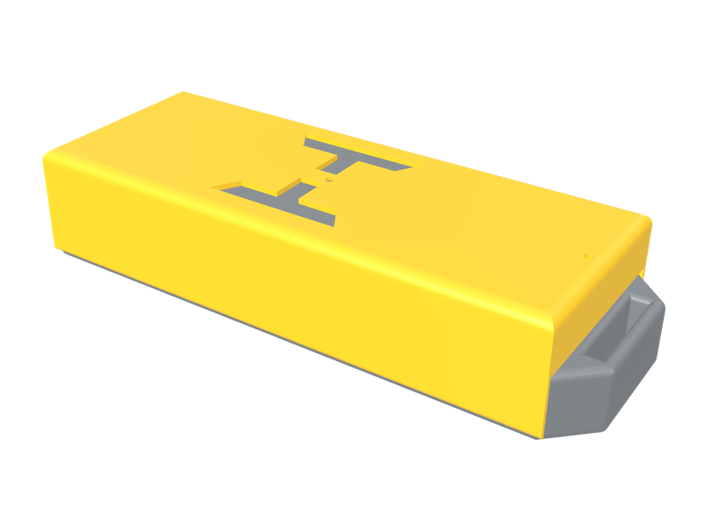

<picture><source media="(prefers-color-scheme: dark)" srcset="../assets/brand/logo-wordmark-tight-duotone.svg"></picture>

# Hardware

[← Voltar ao README](../README.md)



Dois dispositivos, ambos projetados, montados, programados e encapsulados pela Con-Hectar: a **coleira** (amarela), que vai no animal, e o **gateway** (cinza), que fica na sede da fazenda.

---

## Coleira

<table>
<tr>
<td width="30%" align="center" valign="top"></td>
<td valign="top">

**Função:** acordar, obter um fixo GNSS, entregá-lo ao gateway com confirmação e voltar a dormir — gastando o mínimo de energia possível.

**Protótipo atual**
- Microcontrolador AVR em placa de desenvolvimento
- Receptor GNSS u-blox
- Transceptor LoRa sub-GHz em modo transparente
- Bateria e chave de alimentação
- Case impresso em 3D, com encaixe para correia

**Firmware** em C++, organizado como uma máquina de estados de energia. A coleira opera em um ciclo de otimização de bateria: hiberna sem satélites, comunica o status ao gateway e envia uma rajada de pings por ativação.

</td>
</tr>
</table>

### O ciclo de trabalho

```
acorda
 ├─ escuta o GNSS até obter um fixo NOVO (ou estourar o tempo)
 ├─ monta o frame: $P (fixo) ou $S (sem fixo)
 ├─ troca a escuta para o rádio
 ├─ atraso aleatório
 ├─ até N tentativas:  transmite → aguarda ACK → backoff aleatório
 ├─ seq++
 └─ dorme: rádio em modo sleep, MCU em power-down
```

Três armadilhas resolvidas de forma deliberada no firmware:

- **O relógio do MCU congela no power-down**, então a "idade" do fixo não distingue um fixo novo do anterior. A coleira espera o contador de fixos do GNSS avançar.
- **As portas seriais em software ficam em interrupções de mudança de pino.** São desligadas explicitamente antes de dormir — caso contrário, o próximo caractere do GNSS acordaria o MCU na hora e o sono nunca aconteceria.
- **A libc do AVR não formata ponto flutuante.** Coordenadas passam por conversão dedicada; sem isso, latitude e longitude seriam transmitidas vazias.

### Energia — a análise que mudou o roadmap

Implementamos o sono profundo do MCU, o desligamento de periféricos internos e o sono do rádio via pinos de modo. Depois, fizemos a conta honesta:

| Carga | Antes | Depois | Alcançável por firmware? |
|---|---:|---:|---|
| Receptor GNSS | alta | alta | Só com comandos UBX — exige um fio a mais |
| Rádio LoRa | média | ≈ 0 | **Sim** — agora dorme |
| Placa de desenvolvimento (USB, LED, regulador) | média | média | Não — é da placa |
| Microcontrolador | baixa | piso | **Sim** — já no mínimo |
| **Média do ciclo** | | | **≈ 2 % melhor** *(calculado, não medido)* |

**Conclusão:** o MCU é a menor carga do sistema por três ordens de grandeza. O ganho real está em (1) colocar o GNSS em modo de economia, (2) mudar a razão acordado/dormindo e (3) **sair da placa de desenvolvimento para uma PCB própria com MCU de baixo consumo** — exatamente o que está no roadmap. Essa análise evitou que dimensionássemos uma bateria com base numa otimização que não existia.

---

## Gateway

<table>
<tr>
<td width="30%" align="center" valign="top"></td>
<td valign="top">

**Função:** concentrar os sinais LoRa de várias coleiras e retransmitir os dados para a nuvem via internet.

- Raspberry Pi 5, Debian 13
- Módulo LoRa ligado por UART
- Antena externa
- Case impresso em 3D
- Alimentação contínua (tomada)

**Software:** serviço Python gerenciado por `systemd`, que reinicia sozinho e sobe no boot. Quatro responsabilidades:

1. **Confirmar** cada frame válido com o ACK endereçado
2. **Armazenar** em SQLite local, antes de qualquer outra coisa
3. **Encaminhar** para a nuvem quando houver internet
4. **Podar** o buffer com um teto de retenção

Inclui ainda um script de preparação que libera a UART em um Pi recém-instalado e um monitor passivo para trabalho de bancada.

</td>
</tr>
</table>

---

## Evolução do protótipo

<table>
<tr>
<th width="25%">Fase 01 · Esquemático</th>
<th width="25%">Fase 02 · Coleira</th>
<th width="25%">Fase 02 · Gateway</th>
<th width="25%">Fase 03 · Case</th>
</tr>
<tr>
<td></td>
<td></td>
<td></td>
<td></td>
</tr>
<tr>
<td valign="top"><sub>Blocos, barramentos e ciclo de sono desenhados à mão — já apontando para um MCU de baixo consumo e chave eletrônica na alimentação</sub></td>
<td valign="top"><sub>MCU + GNSS + LoRa + bateria em jumpers</sub></td>
<td valign="top"><sub>Raspberry Pi 5 + LoRa em protoboard</sub></td>
<td valign="top"><sub>Coleira e gateway nos cases impressos em 3D</sub></td>
</tr>
</table>

### Em animal

<table>
<tr>
<td width="50%" align="center"></td>
<td valign="top">

Teste de fixação da coleira, já no case final, no pescoço de um animal.

O teste valida o encaixe da correia e o posicionamento do case. Os próximos passos de campo estão no fim desta página: PCB própria e uma segunda coleira ativa.

</td>
</tr>
</table>

### Modelos 3D

Os cases foram modelados do zero. Clique para abrir no visualizador 3D interativo do GitHub — os mesmos modelos aparecem na landing page, renderizados com Three.js.

<table>
<tr>
<td align="center" width="50%"><a href="../models/coleira.stl"></a></td>
<td align="center" width="50%"><a href="../models/gateway.stl"></a></td>
</tr>
<tr>
<td align="center"><a href="../models/coleira.stl"><b>Coleira</b></a> · <code>models/coleira.stl</code></td>
<td align="center"><a href="../models/gateway.stl"><b>Gateway</b></a> · <code>models/gateway.stl</code></td>
</tr>
</table>

---

## Próxima revisão

| Item | Por quê |
|---|---|
| **PCB própria** | Elimina jumpers e a placa de desenvolvimento: menor custo, menor tamanho, menor consumo de base |
| **MCU de baixo consumo** | Sono real em microamperes |
| **GNSS em modo power-save** | Atua sobre 100 % do tempo, não sobre a fração em que a coleira dorme |
| **Buffer de fixos na coleira** | Hoje, se a coleira não alcança o gateway, o fixo do ciclo é descartado. Com buffer, ela descarrega o histórico ao voltar à cobertura ("modo mochila") |
| **Medição de bateria** | Só será mostrada no painel quando for medida de verdade |
| **Segunda coleira ativa** | Validar anticolisão e endereçamento em campo |
| **Gateway como cyberdeck** | O link de internet ficou instável no último teste (sem Starlink). Com sistema operacional e tela próprios, o gateway passa a mostrar o rebanho direto na sede, sem depender de rede — a nuvem vira sincronização, não requisito |
