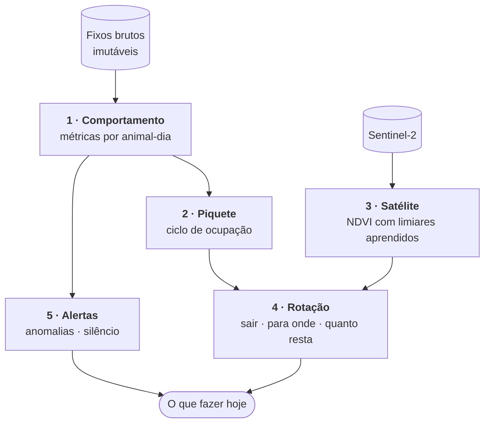
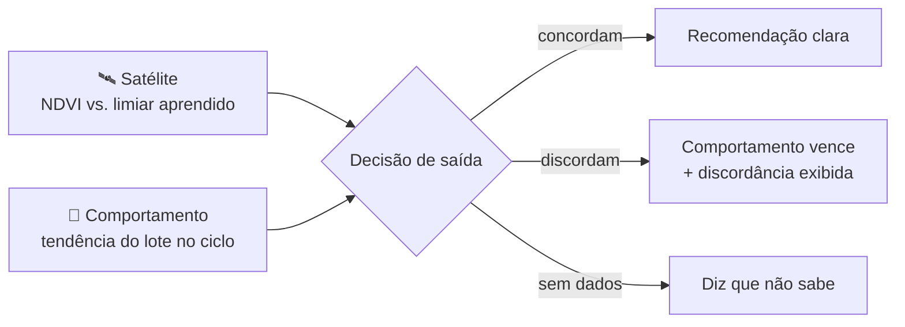

<picture><source media="(prefers-color-scheme: dark)" srcset="../assets/brand/logo-wordmark-tight-duotone.svg"></picture>

# A inteligência

[← Voltar ao README](../README.md)

> Todo produto de telemetria bovina que fracassou no Brasil fracassou pelo mesmo motivo: entregou **posição** quando o pecuarista precisava de **decisão**. Um mapa com bolinhas vai do "uau" ao "e daí?" em cerca de três semanas.

A Con-Hectar transforma uma série de coordenadas com carimbo de tempo — e nada mais — em decisões de manejo. Este documento descreve **o que** cada camada faz e **por que** foi desenhada assim. Limiares, fórmulas e parâmetros calibrados ficam no código proprietário.

---

## 1 · Comportamento — tudo que se extrai de posição e tempo

A coleira reporta latitude, longitude e horário. Não mede temperatura, ruminação, peso nem aceleração — e o software nunca finge que mede. Ainda assim, isso basta para **cerca de vinte métricas úteis por animal-dia**: distância percorrida, deslocamento líquido, sinuosidade, raio de giro, área de uso (polígono convexo mínimo), tempo parado, centroide diário e o **orçamento de atividade** — a fração do dia em *repouso*, *pastejo*, *deslocamento* e *trânsito*.

Três regras governam cada número:

| Regra | Por quê |
|---|---|
| **O intervalo de amostragem é sagrado** | O mesmo animal "anda menos" se amostrado a cada 60 min do que a cada 15. Cada dia carrega o intervalo em que foi calculado, e a plataforma **se recusa** a comparar dias com intervalos diferentes. |
| **Erro de GNSS infla distância** | Fixos sucessivos de um animal deitado produzem "caminhada fantasma" — cerca de +15 % na distância diária. Segmentos abaixo de um limiar de ruído são descartados antes da soma. |
| **Isto não é velocidade** | Com fixos espaçados, mede-se taxa de deslocamento líquido, não comprimento de caminho. Um animal pastejando em círculo registra quase zero — e isso é um sinal legítimo, exatamente o que separa pastejo de deslocamento. A interface nunca o chama de "velocidade" sem qualificar. |

Cada dia também registra sua **cobertura** (fixos recebidos ÷ esperados) e a versão do algoritmo. Um dia com cobertura baixa não é tratado como confiável.

---

## 2 · Piquete — o ciclo de ocupação

As métricas individuais são agregadas por lote e por ciclo de ocupação de cada piquete. O produto central desta camada é a **curva de esgotamento**: conforme a forragem acaba, o tempo de pastejo e a distância diária sobem de forma monotônica. Na literatura com bovinos de corte sob GNSS, o tempo de pastejo subiu de 31 % para 69 % das horas de luz ao longo de um único ciclo (r² = 0,71), e a distância diária cresceu linearmente (r² = 0,88).

**O rebanho avisa que o piquete acabou antes de o satélite conseguir ver.**

---

## 3 · Satélite — forragem sem calibração manual

Um job agendado busca **NDVI zonal do Sentinel-2** para cada piquete com cerca desenhada e grava cada observação com sua fração de cobertura limpa (sem nuvem).

A literatura é clara sobre as duas faces do NDVI: ele **ranqueia e acompanha** um piquete contra ele mesmo muito bem (r² ≈ 0,91 para mudança relativa), e **estima massa seca absoluta** mal sem calibração local (r² ≈ 0,37). A Con-Hectar abre mão do segundo para manter o primeiro honesto:

- **Nenhum kg MS/ha é exibido.** O produto não afirma o que não consegue medir.
- **Os limiares de entrada e saída são aprendidos do histórico do próprio piquete**, não de uma tabela de espécies nem de uma altura digitada. Não há nada para o operador escolher.
- Um piquete novo usa um padrão provisório da literatura — marcado como provisório em todo lugar — até acumular histórico suficiente.
- Passagens antigas ou com pouca cobertura limpa perdem peso na confiança "atual".
- "Dias de pasto restantes" é uma projeção da tendência de queda, exibida **apenas** quando a tendência a sustenta.

---

## 4 · Rotação — o coração do produto

Tudo o mais existe para alimentar esta camada. Ela responde às três perguntas do pecuarista.

### Quando sair? — o voto de duas fontes

Cada fonte vota *sair*, *seguir* ou *sem dados*. Quando discordam, **o comportamento vence** — o animal está dentro do piquete, e a última passagem limpa do satélite pode ter três semanas. A interface mostra a discordância em vez de escondê-la.

### Para onde? — a fila de rotação

Cada piquete tem um estado (**ocupado · pronto · em descanso · descanso insuficiente**) e um tempo de descanso que pode vir de três fontes, sempre identificadas: definido manualmente, **aprendido** dos ciclos anteriores do próprio piquete, ou padrão. A fila ordena os candidatos pela recuperação observada no satélite e pelo descanso cumprido, e projeta datas de entrada — sempre com `~`, porque são estimativas.

### Carga do lote

A carga é expressa em **Unidade Animal** (a língua que o pecuarista fala) por hectare **pastejável** — a área útil, não o polígono — o que a torna comparável entre piquetes e entre fazendas.

### Divisão automática de pastagens

Uma pastagem desenhada pode ser dividida em N piquetes cortados perpendicularmente ao seu eixo maior (como um cerqueiro passaria o fio), com **área pastejável equivalente** e balanceamento pelo NDVI. O número sugerido de piquetes segue a fórmula clássica do pastejo rotacionado a partir dos dias de descanso e de ocupação. Geometria pura sobre o que a fazenda já desenhou: nenhum dado é inventado, e cada faixa vira uma cerca real que o resto da plataforma trata como qualquer outra.

---

## 5 · Alertas

### Anomalias

| Alerta | Severidade | O que indica |
|---|:-:|---|
| Falha de aguada | 🔴 crítica | Comportamento anômalo do lote inteiro ligado ao ponto de água — infraestrutura, não doença |
| Animal caído | 🔴 crítica | Sem deslocamento por tempo prolongado, **com a coleira ainda transmitindo** |
| Possível doença | 🟠 alta | Atividade persistentemente muito abaixo do lote |
| Isolamento | 🟠 alta | Animal longe do centro do lote, em relação à dispersão do próprio lote |
| Coesão do rebanho | 🟠 alta | O lote se dispersando de forma atípica |
| Candidato a cio | 🟡 média | Pico de atividade contra a linha de base do próprio animal |

Quatro regras não são opcionais:

1. **Linha de base robusta** (mediana e MAD, nunca média e desvio-padrão). As distribuições têm caudas pesadas, e um único dia de manejo destrói uma média.
2. **Toda pontuação é normalizada contra o lote no mesmo dia** antes de virar alerta. Isso elimina chuva, calor, troca de piquete e manejo como classe inteira de falso positivo.
3. **Persistência, não uma janela só.** Um alerta que pisca é um alerta ignorado.
4. **Dez animais com a mesma anomalia no mesmo piquete são um alerta de lote**, não dez alertas individuais — e esse agrupamento já é o diagnóstico: aponta para água, cerca ou porteira.

Cada alerta carrega uma frase curta, **os números que o produziram** (ninguém precisa confiar numa caixa-preta) e **o que fazer a seguir**.

### Silêncio

Quando uma coleira para de falar, há causas muito diferentes — e tratá-las como um alerta único destrói a credibilidade do produto, porque a maioria é banal e uma é emergência.

| Classificação | Evidência usada |
|---|---|
| **Reportando** | Uplinks chegando normalmente |
| **Nunca reportou** | Dispositivo cadastrado sem nenhum fixo |
| **Provável sombra de rádio** | Último enlace já no limite (RSSI/SNR) e/ou vizinhos próximos também em silêncio |
| **Falha de dispositivo** | Silêncio em área de boa cobertura, com vizinhos reportando normalmente |
| **Silêncio sem explicação** | Nenhuma das anteriores — investigar |

Cada veredito tem um grau de confiança, uma mensagem pronta para encaminhar por WhatsApp e a evidência por trás. A plataforma também constrói um **mapa de cobertura de rádio** e a **taxa de entrega** por coleira — as sombras de rádio explicam a maior parte dos "sumiços" e são o principal argumento para posicionar gateways adicionais.

**Bateria fica de fora de propósito:** a coleira não reporta carga, então um veredito de bateria seria um palpite fantasiado de evidência.

---

## O que não prometemos

Sem trocar o hardware, a Con-Hectar **não** promete ruminação, temperatura corporal, peso, cerca virtual com contenção por estímulo, ou estimativa absoluta de massa de forragem sem calibração. Um sistema que só lista suas forças não pode ser verificado.
