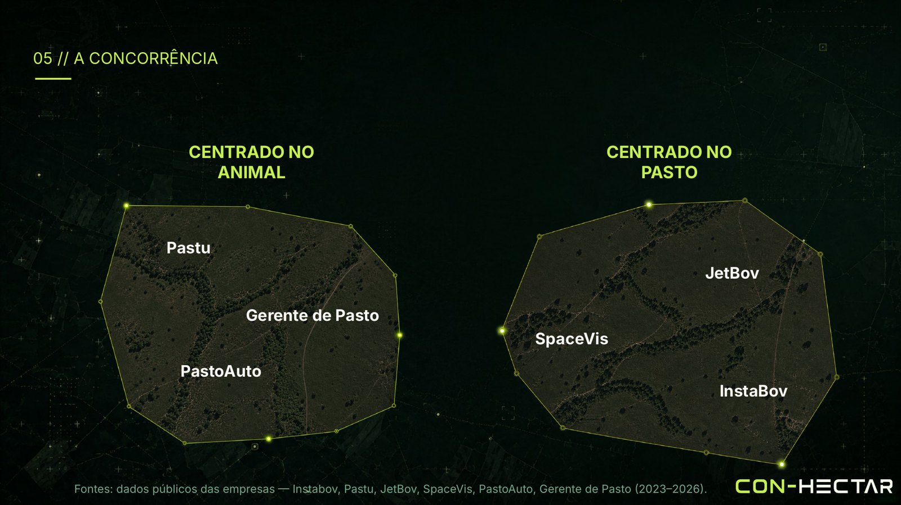
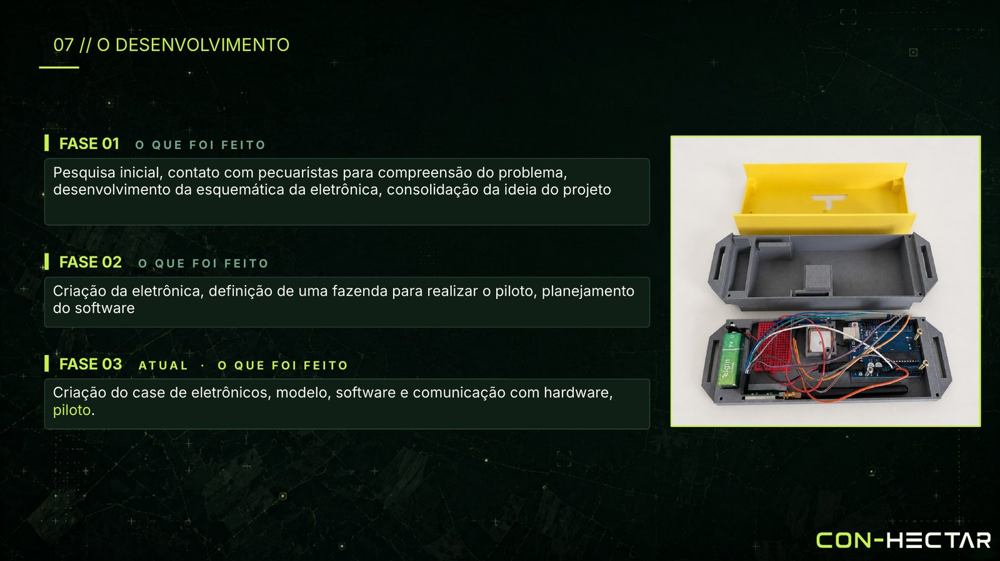

# Negócio

[← Voltar ao README](../README.md)

> **Nossa direção:** a melhor versão do campo na palma da mão de quem mais precisa.

---

## O problema

| | Produtividade | |
|---|:-:|---|
| Fazenda ineficiente | **5 @/ha/ano** | |
| Fazenda eficiente | **12,9 @/ha/ano** | **2,7×** |
| Diferença de margem bruta | **R$ 441,38/ha/ano** | |

Fontes: ABIEC, 2024; Rally da Pecuária, 2023; Senar/MS (ATG), 2026.

O gap é, em grande parte, de **manejo de pastagem** — decidido hoje no olho, com rondas espaçadas e sem dado.

---

## O mercado

| Indicador | Valor | Fonte |
|---|:-:|---|
| Rebanho bovino | **238 mi** cabeças | IBGE, PPM 2024 |
| Movimentado pela cadeia | **R$ 1,1 tri/ano** | ABIEC, Beef Report 2026 |
| Área de pastagem | **167 mi ha** | ABIEC, Beef Report 2026 |

### Onde está o gado

| Faixa de área | Estabelecimentos | Cabeças | Participação no rebanho |
|---|:-:|:-:|:-:|
| Menos de 100 ha | 2.158.947 (84,75 %) | 50,1 mi | 29,03 % |
| De 100 a 1.000 ha | 348.101 (13,67 %) | 63,6 mi | 36,86 % |
| **Acima de 1.000 ha** | **40.291 (1,58 %)** | **58,9 mi** | **34,11 %** |

Fonte: Censo Agropecuário 2017 (IBGE), compilado no Anuário CiCarne 2025-2026 (Embrapa).

**1,58 % das propriedades detêm mais de um terço do rebanho.** É por aí que se começa.

### TAM · SAM · SOM

| | Valor | Base |
|---|:-:|---|
| **TAM** | R$ 6,21 bi/ano | 172,6 mi cabeças no Brasil |
| **SAM** | R$ 2,12 bi/ano | 58,9 mi cabeças em 40.291 propriedades acima de 1.000 ha |
| **SOM** | R$ 25,92 mi de ARR | 600 fazendas no quinto ano |

---

## Modelo de receita

| | |
|---|---|
| **Assinatura** | R$ 3 por cabeça/mês |
| **Ticket médio** | R$ 43,2 mil por fazenda/ano (fazenda-modelo de 1.200 cabeças) |
| **Hardware** | Cobrado separadamente — venda, aluguel ou financiamento |

Cobrar **por cabeça**, e não por coleira, é uma escolha deliberada: o valor entregue é decisão sobre o rebanho e a pastagem — e a funcionalidade que justifica esse modelo é a projeção de quando o pasto vai faltar.

---

## Concorrência

| Centrados no animal | Centrados no pasto |
|---|---|
| JetBov · InstaBov · Gerente de Pasto | SpaceVis · PastoAuto · Pastu |

O mercado se divide entre quem olha para o **boi** e quem olha para o **capim**. A Con-Hectar se posiciona na interseção:

> **Buscamos capitalizar no que importa para o gado, sem deixar de olhar para ele.**

O diferencial não é a coleira — que tende a virar commodity — nem o dashboard — que é copiável. É a **fusão satélite × comportamento** e o ativo que ela gera: um rebanho de 1.000 cabeças acompanhado por uma safra produz na ordem de **300 mil animal-dias** rotulados com forragem observada por satélite. Esse corpus é a barreira de entrada real.

Fontes: dados públicos das empresas (2023–2026).

---

## Roadmap

### Onde estamos

| Fase | | Status |
|:-:|---|:-:|
| **01** | Pesquisa com pecuaristas, esquemático da eletrônica, consolidação da ideia | ✅ |
| **02** | Eletrônica em bancada, fazenda-piloto definida, planejamento do software | ✅ |
| **03** | Case, modelos 3D, software e comunicação hardware ↔ nuvem; piloto | 🟢 em andamento |

### Próximos passos imediatos

- [ ] Resolver a conectividade do gateway na rede da fazenda
- [ ] Melhorar a geração automática de piquetes em períodos de seca e com poucas imagens limpas
- [ ] Coleira em PCB própria
- [ ] Piloto com +1 coleira ativa

### Horizonte do produto

| Fase | Foco | Entregas |
|---|---|---|
| **Confiança** | O cliente confia no dado | Ingestão robusta, mapa vivo, mapa de cobertura de rádio, desambiguação de silêncio, alertas críticos, app offline-first e alertas por WhatsApp |
| **Decisão** | As recomendações são seguidas | Pipeline de satélite completo, motor de rotação com dias de pasto restantes, curva de esgotamento, relatório mensal automático |
| **Alavancagem** | O dado vira ativo | Projeção de vazio forrageiro e simulador de cenários, módulo reprodutivo, modelos aprendidos por fazenda, integrações (PNIB, balança, GTA, CAR) e visão multi-fazenda para consultores |
