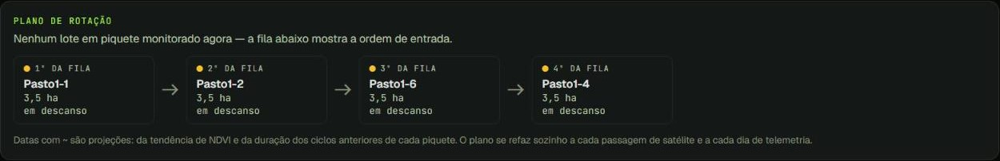
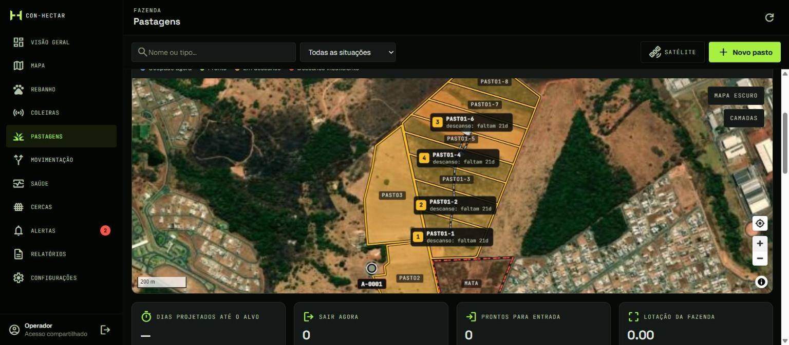
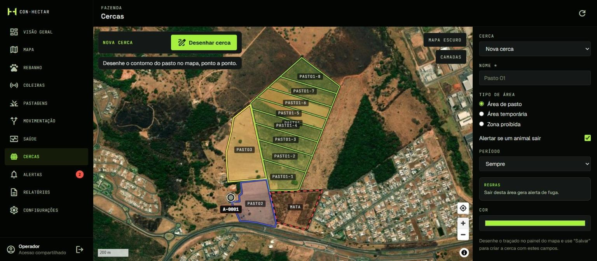
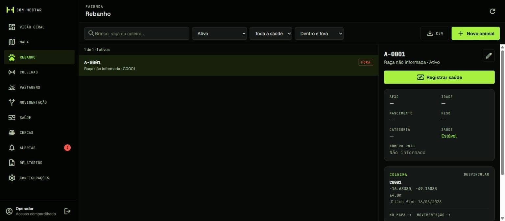
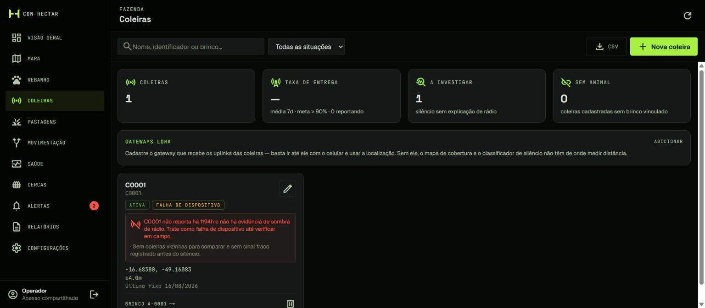
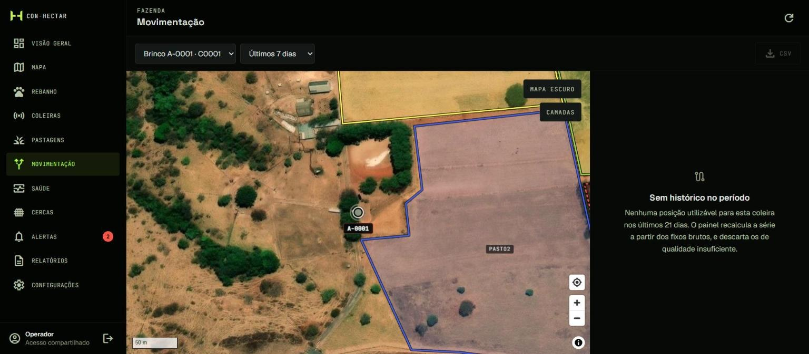

<picture><source media="(prefers-color-scheme: dark)" srcset="../assets/brand/logo-wordmark-tight-duotone.svg"></picture>

# Plataforma

[← Voltar ao README](../README.md)

Três superfícies, um único sistema de design:

| Superfície | Para quem | Stack |
|---|---|---|
| **Painel web** | Gerente e proprietário, no escritório ou na sede | Next.js 16 (App Router) · React 19 · TypeScript · Tailwind 4 · MapLibre GL |
| **App de campo** | Peão e capataz, no pasto, no sol, com sinal ruim | Expo · React Native · Expo Router (iOS, Android e Web) |
| **Landing page** | Pecuarista conhecendo o produto | Next.js · Three.js (visualizador 3D do hardware) |

---

## Os três modos de uso

O painel não é uma tela única: ele precisa servir bem a três trabalhos diferentes.

1. **Detecção rápida de anomalia** — tem algum animal fora da cerca, doente ou sem sinal *agora*?
2. **Análise histórica** — como o rebanho e as pastagens se comportaram ao longo do tempo, para decidir e reportar.
3. **Configuração** — desenhar cercas, cadastrar animais e coleiras, ajustar limiares.

O critério de sucesso é um só: **o gerente confiar no painel o bastante para agir sem ir conferir no campo.**

---

## Módulos

### Visão geral
"O que fazer hoje" — uma lista curta de recomendações priorizadas (tirar o lote do piquete X, uma coleira muda em área de boa cobertura, animais fora da cerca), ao lado do mapa e do resumo do rebanho. Cada fato aparece em **uma** superfície só — o painel foi deliberadamente enxugado para eliminar redundância.

### Mapa
Cada animal em tempo real sobre imagem de satélite, com trajetos, cercas, piquetes, gateways e pontos de recurso (água, cocho). Gateways e cochos são posicionados com um toque no mapa. Fixos de baixa qualidade aparecem, mas são marcados e nunca entram nos cálculos.

### Pastagens
O coração operacional:
- Piquetes desenhados no mapa, com **NDVI** sincronizado automaticamente do Sentinel-2
- Estado em semáforo: **ocupado · pronto · em descanso · descanso insuficiente**
- **Faixa de plano**: a sequência de rotação como cartões, com datas de entrada projetadas (sempre marcadas com `~`) e uma única ação — *Registrar mudança*
- Setas de fluxo no mapa: a mudança recomendada agora é sólida; a sequência projetada depois dela é tracejada — "faça isto" e "depois, provavelmente isto" nunca se confundem
- **Divisão automática** de uma pastagem em piquetes, com pré-visualização antes de confirmar
- Curva de esgotamento do piquete ao longo do ciclo de ocupação

### Cercas
Cercas virtuais com regras de entrada/saída e períodos de vigência. A detecção usa distância assinada até o polígono com **histerese** (dentro → aproximando → fora), para que um animal andando na linha da cerca não gere uma sequência de alertas piscando. As regras foram modeladas para que seja **impossível declarar uma combinação incoerente**.

> A coleira **detecta e avisa**; ela não contém o animal. Não há atuador no hardware, e o produto não promete o contrário.

### Rebanho
Animais e lotes, com o vínculo animal ↔ coleira registrado ao longo do tempo.

### Coleiras
Estado de cada dispositivo, último fixo, qualidade do enlace de rádio e o **diagnóstico de silêncio** (ver [`inteligencia.md`](inteligencia.md#silêncio)).

### Movimentação
Distância diária filtrada, área de uso, sinuosidade e **orçamento de atividade** (parado · pastejo · deslocamento · trânsito) por animal e por lote, sempre comparados contra o próprio lote no mesmo dia.

### Saúde
Eventos sanitários registrados manualmente e anomalias comportamentais detectadas automaticamente, cada uma com a evidência que a produziu.

### Alertas
Central única, com severidade, frase curta "para ler no celular sob o sol", os números por trás da decisão e uma ação sugerida. **Todo alerta termina em uma ação — ou é ruído.**

### Relatórios e Configurações
Indicadores históricos para decisão e prestação de contas; parâmetros da fazenda, intervalo de amostragem e limiares.

---

## App de campo

<table>
<tr>
<th width="25%">Mapa principal</th>
<th width="25%">Ficha do animal</th>
<th width="25%">Cercas virtuais</th>
<th width="25%">Central de alertas</th>
</tr>
<tr>
<td align="center"></td>
<td align="center"></td>
<td align="center"></td>
<td align="center"></td>
</tr>
</table>

<table>
<tr>
<td width="70%" align="center"></td>
<td width="30%" align="center"></td>
</tr>
<tr>
<td><b>Dashboard web</b> — resumo do rebanho, sugestão de manejo e indicadores de pastagem.</td>
<td><b>Tablet em campo</b> — mapa e cercas em tela cheia.</td>
</tr>
</table>

Telas de conceito do design inicial; campos que o hardware não mede (temperatura, bateria) foram retirados da versão em funcionamento.

App multiplataforma em Expo com mapa da fazenda (MapLibre nativo e web), rebanho, cercas e ajustes. O desenho de cercas funciona com o dedo, no próprio pasto. A mesma base de dados e o mesmo vocabulário visual do painel.

---

## Sistema de design — "The Ops Console"

O painel é um instrumento de controle de missão para gado no campo: feito para ser **escaneado**, não admirado.

| Token | Valor | Uso |
|---|---|---|
|  Console Black | `#060906` | Fundo |
|  Signal Lime | `#a8f040` | O único acento: ação primária, estado ativo, "está tudo certo" |
|  Signal Amber | `#fbbf24` | Atenção, não urgente |
|  Breach Red | `#ff5449` | Exclusivo para alerta crítico — nunca decorativo |

**Tipografia:** Space Grotesk (títulos) · Geist (texto e dados) · JetBrains Mono em caixa alta (tudo que se comporta como telemetria).

**Regras que guiam cada tela**
- **Três faixas de status, e só três.** Um estado novo ganha rótulo e ícone, nunca uma cor nova.
- **Profundidade só por tons**, sem sombra nem desfoque no painel.
- **Contraste verificável:** nenhum texto com opacidade — todo tom de texto passa 4,5:1 em todas as superfícies (WCAG 2.1 AA).
- **Movimento significa algo:** animação só para mudança de estado ao vivo.
- **Duas intensidades, um sistema:** a landing page "performa" (brilho, scanlines, cerca se desenhando); o console "trabalha".
- **Paridade campo e mesa:** toda tela funciona num monitor e num celular ao ar livre.
- **Honestidade:** todo número da landing page rastreia até uma medição ou um modelo; o que é calculado diz que é calculado, e a página tem uma seção sobre **o que o equipamento não faz**.
